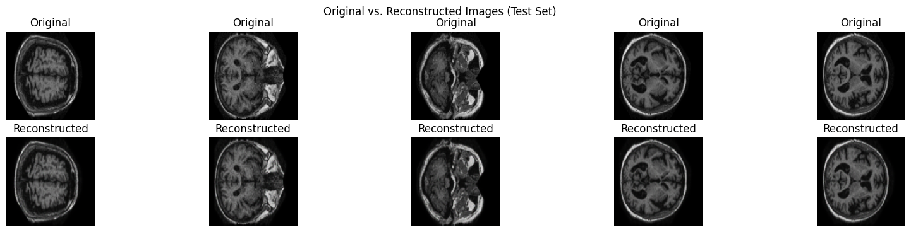

# Project in Modern Methods in Machine Learning 
Using the OASIS dataset we trained Convolutional Autoencoder (CAE) and classifier for Alzheimer's disease. Then the model was used to reconstruct and diagnose the pictures given in 4 different categories based on the stage of the disease .
# Model components
We have a Encoder with 3 convolutional layers
-Latents space with 128 dimension
-Decoder with 4 convolutional layers
-Clasifier with 3 dense layers
# Training 
Autoencoder Training:
   - Loss Function: mean_squared_error (MSE), which measures the difference between original and reconstructed images.
    -Optimizer: Adam optimizer with a learning rate of 0.0005.
    -Epochs: It was initially trained for 100 epochs. Then, it was re-trained with EarlyStopping (monitoring validation loss with a patience of 10 epochs) to prevent overfitting, which typically halted training around 30 epochs.

-Classifier Training:
  -Loss Function: sparse_categorical_crossentropy because the labels (y_train) are integers.
   - Optimizer: Standard adam optimizer.
   - Epochs: Trained for 20 epochs.
    

example reconstruction with aec

